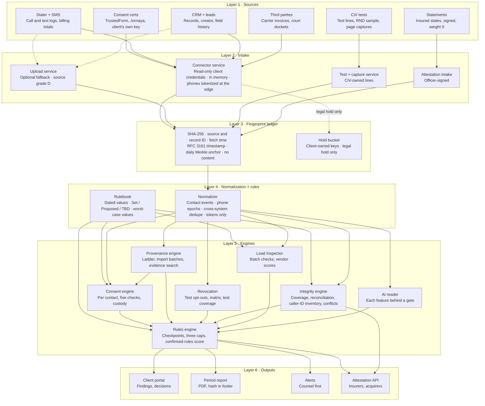
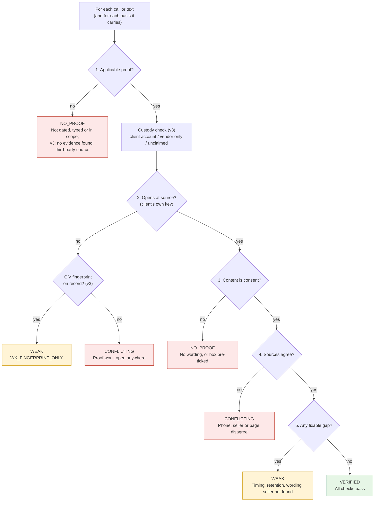
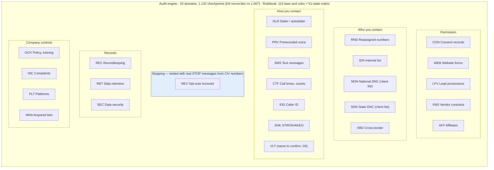
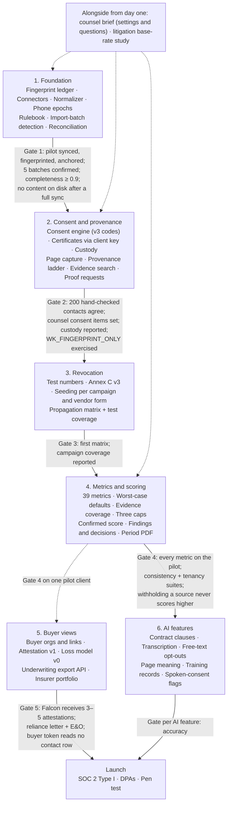

# Architecture — CiV Automated TCPA Audit System

**Version:** 3.0 · **Date:** 2026-10-07 · **Status:** Draft for engineering review
**Companion documents:** [design.md](design.md) (detailed design), [specs/01-engineering-spec.md](specs/01-engineering-spec.md), [specs/CHANGELOG-v3.md](specs/CHANGELOG-v3.md) (what v3 changed)

**[v3]** This version applies Engineering Spec v3 (Oct 7, 2026) on top of v1.1.
Changed or new passages are marked **[v3]**; anything not marked stands as
written in v1.1. The owner's decision of 2026-10-07 governs stored data: CiV
holds only its own analyzed data and fingerprints, never the client's CRM or
other records ([CHANGELOG-v3 §2](specs/CHANGELOG-v3.md#2-owner-decision-civ-holds-analyzed-data-only-shakib-2026-10-07)).

---

## 1. Architectural principles

1. **[v3] Fingerprint first; content never kept.** Nothing is checked until each source record has been fingerprinted into the fingerprint ledger: SHA-256, source system, source record ID, fetch time, trusted timestamp, daily anchor. The record itself is read in memory and dropped when the job ends. CiV keeps its own analyzed data (derived facts, results, scores, findings, reports) and the fingerprints; the client keeps the records. *(v1.1: "Evidence first", with raw artifacts in an evidence store as the system of record. Superseded by ADR-12.)*
2. **Pure evaluation.** The consent engine and rules engine are deterministic functions of (normalized data, rulebook version, `evaluation_as_of`, code version). No wall-clock reads, no network calls, no randomness. **[v3]** A past result reproduces exactly only while the client's records still match their fingerprints; otherwise it is labeled "inputs changed since evaluation" and is never silently recomputed.
3. **Versioned everything.** Rows are closed, never overwritten. Rulebooks are versioned. AI outputs are stored with model and prompt version. Every result links to its `run`.
4. **Tenant isolation by construction.** `client_id` on every table, row-level security enforced in Postgres. **[v3]** Per-client HMAC keys in a KMS turn phone numbers into `phone_token` (replaces per-client artifact encryption keys). Buyers reach a client's data only through `buyer_link`, enforced in RLS.
5. **[v3] Fail to worst case, never to a guess.** A score input that CiV cannot verify (source grade S or N) takes its pessimistic worst-case value from the Rulebook and is flagged `worst_case`. Nothing the client says can raise a score. A TBD rule value stops its checkpoint (`not_run`, `RULE_PENDING`). An ungated AI feature or a 0 ÷ 0 still yields "not measured", never a pass. *(v1.1: "Fail to not measured" for missing sources. Superseded by ADR-14.)*
6. **Small, bounded units.** Each component has one purpose, a defined interface and can be tested with fixtures alone.
7. **[v3] Every number states its basis.** Each value carries its source grade (A, B, C, D, S, N); every score, attestation and export shows evidence coverage beside it.
8. **[v3] Three readers, one record.** The client (portal), the insurer (attestation and export) and the acquirer (diligence file) read the same analyzed data. Buyers never see contact-level rows.

## 2. System context

**[v3]** Redrawn for store-nothing, the three readers and the client-owned hold bucket.

```
                          ┌───────────────────────────────────────────────────┐
   Client systems         │                CiV Audit System                   │      External
   (client credentials,   │   keeps fingerprints + its own analyzed data      │      (CiV accounts)
    read-only)            │                                                   │
   TrustedForm, Jornaya ─▶│  Connector service                                │◀──── KMS (per-client HMAC keys)
    (client's own key)    │  in memory · phones tokenized at the edge         │◀──── Somos RND (CiV queries)
   Five9 / Convoso ──────▶│        │                                          │◀──── Carrier lookup + invoices
   Twilio (+ billing) ───▶│        ▼                                          │◀──── Court dockets (RECAP, PACER)
   Salesforce / HubSpot ─▶│  Fingerprint ledger ─▶ Normalizer ─▶ Engines      │◀──── Email verification, RDAP
   LeadConduit ──────────▶│        ▲                                 │        │◀──── OpenTimestamps, RFC 3161 TSA
   Uploads (fallback) ───▶│  Upload service                          ▼        │◀──── LLM provider
                          │                                       Outputs ────┼────▶ Client portal (owner, legal, operations)
   Public consent pages ─▶│  Test + capture service                           │────▶ Insurer underwriter (attestation, export API)
   CiV test numbers ◀────▶│  (test lines, captures, callbacks, RND sample)    │────▶ Acquirer deal counsel (diligence export)
   Officer statements ───▶│  Attestation intake                               │────▶ Alerts (counsel first)
                          └─────────────────────────┬─────────────────────────┘
                                                    ┆ legal hold only (CiV write-only role)
                                                    ▼
                                   Hold bucket — owned by the client, client's keys
```

The dashed path is the only place a copy of a client record exists, and it
lives in the client's own bucket.

## 3. The six layers (as in the v1.0 diagram)

**[v3]** The layers stand, but Layer 3 is now the **fingerprint ledger**
(was the evidence store), and two engines are new: Provenance and Integrity.
*Every record is fingerprinted, never stored, before any check runs.* The
v1.1 diagram (evidence store with S3 Object Lock) is superseded.



| Layer | Components | Input | Output | Key requirement |
|---|---|---|---|---|
| **1 Sources** | Consent certs, dialer + SMS, CRM + leads, client uploads (fallback); carrier lookup, email verification, RDAP; CiV page captures, CiV test numbers. **[v3]** adds carrier and vendor invoices, court dockets, CRM creator and field history, dialer list ID and insert time, SMS billing totals, officer-signed statements | — | Records read in memory | Vendor terms confirmed before each adapter. **[v3]** Access level 0–4 decides which checks run; Level 1 (dialer + messaging logs) is the minimum for monitoring |
| **2 Intake** | **[v3]** Connector service (core path), Upload service (fallback), Test + capture service, Attestation intake | Client credentials, files, CiV test lines, signed statements | Fingerprints, `phone_token`s and derived fields; content dropped | Client-owned credentials, read-only or least-privilege, every call in `access_log`. **[v3]** In memory only; tokenize at the edge; read billing totals or mark reconciliation "not available" |
| **3 Fingerprint ledger** **[v3]** | `fingerprint` table, hasher, Merkle anchor job, KMS key service, hold-bucket writer | Records in memory | `fingerprint` rows, anchors, inclusion paths | SHA-256 at fetch; trusted timestamp; daily anchoring; no content at rest. *(v1.1: evidence store on S3 Object Lock. Superseded.)* |
| **4 Normalization + rules** | Normalizer, deduper, epoch resolver, location resolver; Rulebook loader | Records in memory (same job); rulebook version | `contact_event`, `consent_proof`, `opt_out_event`, `lead`, `evidence_event`, `phone_epoch`, `address_version`; resolved rule values | Dedupe across systems only; epochs as ranges with certainty. **[v3]** Tokens only; Rulebook carries a worst-case value per score input; TBD values gate execution |
| **5 Engines** | Consent engine, **[v3]** Provenance engine, Revocation, **[v3]** Integrity engine, Rules engine, Lead Inspector, AI reader | Normalized rows, rulebook, `evaluation_as_of` | `consent_evaluation`, `import_batch`, `proof_request`, `revocation_test`, `reconciliation`, `caller_id_inventory`, `attestation_conflict`, `lead_result`, `ai_output`, `checkpoint_result` | Same inputs + `evaluation_as_of` = same result; per-basis evaluation. **[v3]** Worst case for unverified inputs; three caps; confirmed-rules score |
| **6 Outputs** | Portal (findings and decisions), period report PDF, alert router, **[v3]** attestation builder and underwriting export API | Engine rows | Scores with evidence coverage, findings, decisions, reports, alerts, attestations | Banned-word check; internal-only visibility for provisional runs. **[v3]** Built only from CiV's analyzed data; buyers never see contact-level rows |

Data flows strictly downward. A layer may read anything below it and never
writes to a layer above. **[v3]** Re-running a layer reproduces its output
while the client's source records still match their fingerprints (principle 2).

### 3.1 Consent decision per contact (v1.0 diagram, v1.1 ranking, v3 codes)

**[v3]** Adds the custody check before step 2, `WK_FINGERPRINT_ONLY` at
step 2, and the manual-import codes at step 1.



Each proof gets a status from its first failing step; the best proof wins
(VERIFIED > WEAK > CONFLICTING > NO_PROOF, ties to the most recent capture);
the contact's status is the worst across its bases. **[v3]** Step 4 phone
match uses the provider's `fingerprints.matching` (CiV submits the phone);
seller mismatch runs only when counsel sets `seller_named_required`. Fill time
and paste feed the vendor score, never a consent status. The "CiV stored
copy" path is removed.

### 3.2 Audit engine: 25 domains in 6 families (v1.0 diagram)



**[v3]** No audit domain is added. Metrics grow from 33 to 39 (M32–M37); M36
(evidence coverage) and M37 (records completeness) form a new **Integrity**
metric family. The client's DNC check records (M13 "DNC Check Record Check")
are Info only and never enter the score. IDN and REV carry the new
contact-after-stop cap (§4.15).

### 3.3 Build phases and gates (v3 build order)

**[v3]** Replaces the v1.1 Phases 0–5 (upload-only Phase 0 is withdrawn;
ADR-7 superseded by ADR-16). Integrity checks move into Phase 1, because every
score depends on them.



Phase 5 can start as soon as Gate 4 passes on one pilot client; it does not
wait for Phase 6. Every build phase ends with a human-reviewed checklist:
auth, tenancy isolation, input validation, error handling, logging, and **no
content at rest**.

## 4. Component catalogue

For each component: purpose, interface, dependencies, key invariants. Detailed algorithms are in [design.md](design.md).

**[v3] Status of each component against v1.1:**

| Component | v3 status |
|---|---|
| 4.1 Connector service | Changed: in memory, tokenize, fingerprint, read billing totals, drop content |
| 4.2 Upload service | Demoted to an optional fallback (grade D) |
| 4.3 Page capture, 4.4 RND client, 4.5 Inbound handler | Now parts of the Test + capture service (4.14) |
| 4.6 Evidence store | Replaced by the **fingerprint ledger** |
| 4.7–4.9 Normalizer, epoch resolver, Rulebook loader | Unchanged except `phone_token`; Rulebook adds worst-case values and status gating |
| 4.10 Consent engine | v3 codes, custody check |
| 4.11 Rules engine | TBD values gate execution |
| 4.14 Revocation tester | Becomes the **Test + capture service** |
| 4.15 Metric calculator and scorer | 39 metrics, worst case, coverage, three caps, confirmed score |
| 4.16 Delivery | Findings and decisions, period PDF, attestation API |
| 4.17–4.21 | New: Provenance engine, Integrity engine, Attestation intake, Hold bucket, Buyer access |

### 4.1 Connector service (Layer 2 · Intake)

- **Purpose:** pull records from client tools through published APIs; one adapter per vendor behind a common interface. **[v3]** This is the core path; uploads are a fallback.
- **Interface:** `Adapter.backfill(client, since, until) → Iterator[RawRecord]`, `Adapter.incremental(client, cursor) → (Iterator[RawRecord], cursor)`, `Adapter.webhook(payload) → RawRecord`, `Adapter.health() → {last_sync, freshness_ok}`. **[D35]** `Adapter.subscribe(client) → mode (live / poll)` registers webhooks or change events where the vendor offers them; `Adapter.changes_since(client, cursor)` serves the hourly catch-up; `Adapter.list_all(client)` serves the weekly full comparison. **[v3]** `Adapter.billing_totals(client, period) → totals | not_available`. `RawRecord` lives only in the job's memory.
- **Dependencies:** secrets vault (credentials), access log (every call), **[v3]** KMS (the client's HMAC key, fetched per job), fingerprint ledger (writes fingerprints), normalizer (runs in the same job).
- **Invariants:** hashes the *raw response bytes*, not a re-serialized object; never calls a billed vendor operation without a stored written approval; never a write scope. **[v3]** Phones become `phone_token` inside the job before any write; nothing is written except fingerprint rows and derived values; content is dropped when the job ends. Certificate lookups use the client's own key only; CiV never claims or retains a certificate in its own account (rule 14).
- **Adapters, in pilot order (D3):** TrustedForm Certificate API v4, then the pilot client's dialer, SMS platform, CRM, lead platform. **[v3]** The pilot is now Falcon Risk's pilot insureds (D3). Dialer + messaging logs (Level 1) are the minimum for monitoring. CRM adapters add creator, created time and field history; dialer adapters add list ID and list insert time; SMS adapters add billing totals. New sources: carrier invoices, vendor invoices, court dockets (CourtListener RECAP, PACER). TrustedForm and Jornaya are one vendor (ActiveProspect): keep both behind one certificate interface.

### 4.2 Upload service (Layer 2 · Intake) **[v3: demoted]**

- **Purpose:** **[v3]** optional fallback for tools without an API; source grade D (weight 0.7). Nothing in the core path requires it.
- **Interface:** `POST /uploads` (multipart) → fingerprint rows and derived rows; declared `upload_type` (dialer_export, dnc_check, litigator_list, complaint_log, contract, policy, training_log, recording, signed_form, rnd_query_log, carrier_invoice, vendor_invoice).
- **Invariants:** **[v3]** parsed, fingerprinted and discarded in the same job; the file is never kept. *(v1.1: stored byte-for-byte, parsed later. Superseded.)*

### 4.3 Page capture (Layers 1–2 · CiV-captured source)

- **Purpose:** render public consent pages with a headless browser; take a page image, DOM, normalized text and measurements; **[v3]** source grade A. Part of the Test + capture service (4.14).
- **Interface:** `capture(url, viewports) → page_capture`, scheduled per `page_capture_interval_hours` for every known consent URL (client forms + every `capture_url` from leads + partner-list links).
- **Invariants:** normalization removes only `page_normalize_rules` parts before hashing; pages that block capture are recorded as "not captured". **[v3]** Measurements and hashes are kept. Whether CiV keeps its own captures of public pages (CiV-made, not client records) is open (D32a); until decided, keep the fingerprint and measurements only.

### 4.4 RND client (Layers 1–2 · CiV account source)

- **Purpose:** query the Reassigned Numbers Database on CiV's own caller-agent account; **[v3]** source grade A. Part of the Test + capture service.
- **Interface:** `query(phone, date_asked_about) → yes | no | no_data`, budgeted by `rnd_query_budget_per_number`. **[v3]** `exposure_sample(client, period)` draws `rnd_sample_size` contacted numbers for M35.
- **Invariants:** every query logged in `rnd_query_log` with `queried_by = civ`; never counted as the client's pre-contact check (M11). **[v3]** Runs inside a job where the number is present. The M35 sample covers contacts already made, never before a dial (D20).

### 4.5 Inbound handler (Layers 1–2 · CiV test numbers)

- **Purpose:** record every call and text to CiV test numbers; feed revocation tests and caller-ID callbacks.
- **Invariants:** **[v3]** each inbound is CiV's own test data: fingerprinted, with its derived facts kept. Spoken tests play the recording notice until C5 is decided. Test numbers are never shown in any portal role.

### 4.6 Fingerprint ledger (Layer 3) **[v3: replaces the evidence store]**

- **Purpose:** prove what CiV saw, and when, without keeping it. One `fingerprint` row per record read: hash, source system, source record ID, source grade, fetch time, RFC 3161 token, anchor date, content kind.
- **Interface:** `record(client, source_system, source_record_id, grade, content_kind, bytes_in_memory) → fingerprint`, `anchor_daily()`, `inclusion_proof(fingerprint_id) → path`, `compare(fingerprint_id) → matches | changed | no_longer_at_source` (re-fetch and compare), `verify(fingerprint_id, file) → match | no_match`, `legal_hold(client, named_records, reason)`, `release_hold(client, hold_id, legal_user, reason)`, `shred_key(client)`.
- **Storage:** PostgreSQL (`fingerprint`, `merkle_anchor`). No content store; no S3 Object Lock for content.
- **Deletion:** nothing is held to delete. `purge_log` records partial rows removed after an in-memory job fails. At contract end, destroying the client's HMAC key makes every token for that client unlinkable (crypto-shredding), logged in `access_log`.
- **Anchoring:** unchanged: nightly job builds a Merkle tree over the day's `sha256` values, stores root, OpenTimestamps proof and RFC 3161 token in `merkle_anchor`, and each fingerprint's `leaf_index` + `merkle_path`.
- *(v1.1: evidence store on S3 Object Lock with per-client SSE-KMS keys, `put`/`get`/`delete`, `deletion_log`. Superseded by ADR-12.)*

### 4.7 Normalizer (Layer 4)

- **Purpose:** parse records into canonical rows; dedupe across systems; resolve recipient location; version address history.
- **Interface:** `normalize(record_in_memory, fingerprint) → rows`, idempotent on `(fingerprint_id, parser_version)`.
- **Invariants:** only `direction = outbound` rows become contacts; dedupe matches across systems only; two same-system records never merge; dialer/SMS record wins; every row carries **[v3]** `source_fingerprint_id` (was `source_artifact_id`). **[v3]** Runs inside the intake job; writes tokens and derived facts only (time, channel, direction, campaign, dial mode, message category, recipient state and time zone). Message text, recordings, names, emails and street addresses are never written.

### 4.8 Epoch resolver (Layer 4)

- **Purpose:** split a phone number's history into epochs (one holder each) using RND answers and carrier signals; assign contacts and proofs to epochs.
- **Interface:** `resolve(client, phone_token) → [phone_epoch]`, `assign(event_or_proof) → contact_epoch_assignment`.
- **Invariants:** boundaries stored as ranges; certainty known / bounded / unknown; a contact inside a bounded range is "reassignment uncertain"; unknown is never treated as the same person. **[v3]** Keyed by `phone_token`; RND queries that need the number run inside a job where the number is present.

### 4.9 Rulebook loader (Layer 4)

- **Purpose:** load a `rulebook_version` and resolve, for any (key, jurisdiction, date, client), the value in force.
- **Interface:** `Rulebook.load(version_id) → Rulebook`, `rb.value(key, on_date, jurisdiction=None, client_id=None)`. **[v3]** `rb.worst_case(field)`; `rb.status(key) → set | proposed | tbd`.
- **Invariants:** refuses to load if `vs_rate_weights` do not sum to 1, if any `affects_status` key is unapproved in an `approved` version, or if a required key is missing; `provisional` and `draft` versions load but taint every run they feed (`run.output_visibility = internal`). **[v3]** A checkpoint that depends on a TBD value never runs on a placeholder (`RULE_PENDING`); a Proposed value runs and marks the result provisional.

### 4.10 Consent engine (Layer 5)

- **Purpose:** decide one status per contact per basis, then per contact.
- **Interface:** `evaluate(contact_event, proofs, opt_outs, epoch, evidence_events, rb, evaluation_as_of) → consent_evaluation`.
- **Invariants:** pure function; every reason code stored; AI items only after gate; strict/lenient variants run when a rulebook is provisional and a key has `variants`. **[v3]** Custody check before step 2; `WK_FINGERPRINT_ONLY` when a certificate no longer opens but CiV holds its fingerprint; `NP_NO_EVIDENCE_FOUND`, `NP_THIRD_PARTY`, label `EBR_ONLY`; counsel-owned `seller_named_required` (default false), `written_consent_required_by_forum`, `inbound_contact_scope`. See [spec §5a](specs/01-engineering-spec.md) for manual-import evidence.

### 4.11 Rules engine (Layer 5)

- **Purpose:** run every automatable checkpoint from CIV-ATP-01; aggregate per-contact results by `checkpoint.aggregation`.
- **Interface:** `run_checkpoints(client, run) → [checkpoint_result]`.
- **Invariants:** each result references checkpoint, run and rule values used. **[v3]** A missing or unverified input takes its worst-case value (`worst_case = true`) instead of `not_run` / `NEEDS_SOURCE`; a TBD rule value gives `not_run` / `RULE_PENDING`; a Proposed value marks the result provisional.

### 4.12 Lead Inspector (Layer 5)

- **Purpose:** Checks 1–3 per lead; vendor scorecard; dispute candidates.
- **Interface:** `inspect(lead, rb) → lead_result`, `scorecard(client, vendor, window) → vendor_score`.
- **Invariants:** batch only in v1; test leads excluded; never a consumer report. **[v3]** Fill time and paste (check 5 fields) are lead-quality signals here, never a consent status.

### 4.13 AI reader (Layer 5)

- **Purpose:** every AI feature behind one interface with an accuracy gate.
- **Interface:** `ask(feature, inputs, prompt_version) → ai_output` with `confidence`; `gate_status(feature) → passed | not_passed`.
- **Invariants:** outputs cached by `(feature, input_fingerprint_ids, prompt_version, checklist_version, model)`; ungated features produce "not measured"; no AI output ever changes a status on its own below `ai_min_confidence`. **[v3]** Contracts, policies, training files, recordings and message text are read in memory only; the derived output is kept. A recording counts as evidence only after a person confirms the flagged moment. **[D37]** Exception decided by the owner 2026-10-08: **conversation review** (whole-conversation opt-out decisions on calls and texts) counts without a person per item, after its own accuracy gate and above `conv_review_min_confidence`; see design §11.

### 4.14 Test + capture service (Layers 1–2 and 5) **[v3: was the Revocation tester]**

- **Purpose:** everything CiV observes with its own lines and tools (source grade A): revocation tests from CiV test numbers, page captures (4.3), caller-ID callbacks, the RND exposure sample (4.4), the inbound handler (4.5).
- **Interface:** `plan(client, annex_c) → tests`, `observe(test) → opt_out_suppression rows`, `matrix(run) → matrix_cell rows`, **[v3]** `coverage(client, period) → campaigns reached ÷ marketing campaigns`, `callbacks(client) → caller_id_inventory rows`.
- **Invariants:** no test without `annex_c_authorization`; NEVER after `optout_observation_days`. **[v3]** At least one test per marketing campaign, plus each vendor form Annex C authorizes (`seeded_campaign_id`, `seeded_via`); no contact within `seed_contact_window_days` = "not reached", never "passed"; an unreached campaign is "untested". Test numbers rotate every `test_rotation_days` and are never shown in any portal role; timing and channel are randomized within the authorized window. *(v1.1: seeds only through the client's own public forms. Superseded.)*

### 4.15 Metric calculator and scorer (Layer 6)

- **Purpose:** compute every metric card; aggregate checkpoints to domain and overall scores; apply caps and provisional flag.
- **Interface:** `metrics(client, run) → [metric_snapshot]`, `score(client, run) → scores`.
- **Invariants:** 0 ÷ 0 = "not measured"; one decimal place display, bands on the unrounded value. **[v3]** 39 metrics. A missing source takes its worst-case value (M11 without client logs = "not checked"). Every value stores `basis_mix`, `evidence_coverage`, `worst_case_fields`; one denominator per figure. Three caps in order: hard cap (overall ≤ `hard_cap_grade`), **contact-after-stop cap** (any contact after an internal-list entry or an in-scope opt-out → that domain ≤ `direct_violation_grade`), **coverage cap** (coverage < `coverage_cap_floor` → overall ≤ `coverage_cap_grade`). A held grade shows "held" and names the cap. The confirmed-rules score (`SCORE_CONFIRMED`, Set values only) sits beside every overall score.

### 4.16 Delivery (Layer 6)

- **Evidence file builder:** **[v3]** per epoch: fingerprints, fetch times, re-fetch outcomes, anchor proofs, Merkle paths, verifier script and CiV's derived results. The underlying records come from the client or the hold bucket. What the evidence file, certification pack and named-numbers evidence package contain waits on D18 (counsel).
- **Report renderer:** **[v3]** the period audit report is a real PDF rendered by Playwright from the same queries the portal uses; its SHA-256 goes in the footer, the report history and `access_log`. Banned-word check blocks release; standard disclosure appended. *(v1.1: WeasyPrint templates. Superseded.)*
- **Findings and decisions** **[v3: replaces the fix list]:** noun-phrase finding titles; common responses only from `response_library` rows with status Set (counsel-owned); a client decision (accepted / declined / alternative) with a note whose `note_sha256` goes to `access_log`. Overdue is computed against the real date.
- **Alert router:** rules → channels; in counsel-directed mode (now the default, D25) routes only to `legal` role. **[v3]** Opted-out numbers re-added in an import batch raise a High alert.
- **Portal API:** REST, role-based, every read in `access_log`; hides `internal` visibility runs from client roles. **[v3]** Every page is built from CiV's analyzed data only ([CHANGELOG-v3 §2.2](specs/CHANGELOG-v3.md#22-how-civ-shows-everything-without-holding-the-clients-records)).
- **[v3] Attestation builder and underwriting export API:** see 4.21.

### 4.17 Provenance engine (Layer 5) **[v3: new]**

- **Purpose:** give every contacted number a provenance basis; find manual imports; search for evidence behind manual numbers; run proof requests. Detail in [spec §5a](specs/01-engineering-spec.md).
- **Interface:** `ladder(client, phone_token) → basis` (feed → crm_field → invoice → cert_domain → manual_import → untraced), `detect_batches(client, system) → [import_batch]`, `evidence_search(phone_token) → evidence_event | none`, `proof_requests(batch) → [proof_request]`, `untraced_list(client, month)`.
- **Invariants:** integration and API users are excluded before grouping (they are feeds); thresholds `import_gap_seconds`, `import_min_batch` are calibrated on five client-confirmed batches (D21); M06 counts vendor leads and the ladder counts contacts, never mixed in one figure; manual imports are found from API metadata, never from file names or uploads.

### 4.18 Integrity engine (Layer 5) **[v3: new]**

- **Purpose:** measure how far the numbers can be relied on. Detail in [spec §5b](specs/01-engineering-spec.md).
- **Interface:** `coverage(client, run) → evidence_coverage`, `reconcile(client, period) → [reconciliation]`, `caller_id_inventory(client) → rows`, `conflicts(client) → [attestation_conflict]`.
- **Invariants:** evidence coverage = Σ share_g × weight_g (A = B = C = 1, D = 0.7, S = N = 0); reconciliation per period for calls, texts, vendor leads (flag below `completeness_floor`), seat capacity, STOP replies, days present; a flagged period is "incomplete data" and its missing share takes worst-case values; an unknown caller ID is an **unknown calling system** and the top finding until connected or disclaimed in writing; conflicts are shown to buyers as they are, never softened.

### 4.19 Attestation intake (Layer 2) **[v3: new]**

- **Purpose:** record every self-reported answer as an officer-signed `attestation_statement`, shown as "Insured states".
- **Interface:** `submit(client, field_key, statement_text, officer) → attestation_statement` (fingerprinted).
- **Invariants:** weight 0: a statement can lower a value, never raise it (rule 12). The Integrity engine writes conflicts against it.

### 4.20 Hold bucket **[v3: new]**

- **Purpose:** the only place a copy of a client record may exist, for legal hold.
- **Interface:** `snapshot(client, named_records)` re-fetches the named records through the connector and writes one encrypted snapshot to a bucket **the client owns** (their S3 bucket or Supabase project).
- **Invariants:** CiV has a write-only role; the client holds the keys; CiV never reads it back. A hold is first an instruction to the client to keep the named records. Releasing a hold needs a Legal-role user and a reason, both in `access_log`.

### 4.21 Buyer access (Layer 6) **[v3: new]**

- **Purpose:** give insurers and acquirers a standardized view of a company, never its records. Detail in [spec §9a](specs/01-engineering-spec.md).
- **Interface:** `attestation(client, as_of) → attestation_snapshot` (schema `civ.attestation.v1`, monthly, hashed, prior versions kept); `GET /v1/insureds/{client_id}/attestation?as_of=YYYY-MM`; webhook on a score change of 5 points or more, or a new open matter; loss model v0 (labeled **uncalibrated** everywhere, parameters editable by the underwriter).
- **Invariants:** access only through `buyer_link` (granted by the company, scoped, revocable by either side); bearer token per `buyer_org`, rotated every 90 days; every call logged in the insured's `access_log`; buyers resolve only to `attestation_snapshot`, `reconciliation`, `attestation_conflict` and `metric_snapshot` rows. Exports carry decision + hash, never decision note text.

## 5. Data flow, end to end

**[D35] Live sync (owner decision 2026-10-07).** Intake is continuous, not
nightly. Three paths feed the same in-memory steps 1–6 below:

```
Live feed     tool notifies CiV of a change → read that change → steps 1–6 → per-contact checks → urgent alerts (≤ 15 min)
Catch-up      every 60 min: changes since cursor → anything new is a gap (sync_gap) → steps 1–6
Poll          every 5 min, for tools without notifications → steps 1–6
Full sweep    every 7 days: full listing → deleted / silently changed records → frozen + labelled
Scores        every 60 min: metric calculator + scorer from live results (steps 14–16)
Nightly       anchor, epoch resolver, time-dependent re-evaluation, provenance and integrity runs (steps 7–18)
```

### Nightly and scheduled steps

**[v3]** Rewritten for in-memory processing. Content exists only inside a
running job; what is written is fingerprints, tokens and derived facts.

```
1. Connector job starts; fetches the client's HMAC key from the KMS (never on disk)
2. Records are read into memory (connectors; uploads as fallback; CiV test + capture service)
3. Each record is hashed as fetched → fingerprint row (source, record ID, grade, fetch time, RFC 3161 token)
4. Phones are tokenized at the edge → phone_token; the raw number never leaves the job
5. Normalizer (same job) writes derived rows: contact_event, consent_proof, opt_out_event, lead,
   evidence_event, address_version (state + time zone); connectors read billing totals
6. Job ends → content dropped; a failed job removes its partial rows and writes purge_log
7. Anchor job rolls the day's hashes into a Merkle root → OpenTimestamps + RFC 3161
8. Epoch resolver assigns new contacts/proofs to epochs; RND queries run inside a job, within budget
9. Run row created: kind=nightly, evaluation_as_of=now, rulebook_version, code_version
10. Provenance engine: ladder, import batches, evidence search, proof requests, re-added opt-outs
11. Integrity engine: reconciliation, caller-ID inventory, statement conflicts
12. Consent engine evaluates new contacts + contacts whose result depends on time or new data
    (a check that needs content again, such as a certificate lookup, re-fetches in a job)
13. Rules engine runs checkpoints (RULE_PENDING on TBD); Lead Inspector; AI reader (in memory)
14. Metric calculator + scorer: worst-case values, basis mix, evidence coverage, three caps,
    confirmed-rules score → metric_snapshot
15. Finding generator diffs against the last run → open/resolve findings; decisions carried forward
16. Alert router evaluates alert rules → sends (or routes to counsel)
17. Monthly: attestation_snapshot built and hashed; buyer webhooks fire on a 5-point change
18. Run closed; everything references run_id
```

Backfill runs are the same pipeline with `kind = backfill` over a date range
and no alerts. Report runs (`kind = report`) re-evaluate nothing; they render
from a chosen past run. **[v3]** If the client's records no longer match their
fingerprints, the report shows "inputs changed since evaluation" rather than
recomputing.

## 6. Technology stack

**Chosen by the owner on 2026-10-03:** a Next.js + TypeScript portal, a Django
(Python) backend, and PostgreSQL. Rows marked *Decided* are that choice; rows
marked *Proposed* are the conventional options that follow from it and are
confirmed in the plan of the module that first needs them. Build Plan v2
(Sep 24, 2026) proposed Supabase, Drizzle and Inngest; that proposal is not
adopted. **[v3]** These stack decisions stand. What changes is that no
content is stored, so the S3 Object Lock artifact store is withdrawn.

| Concern | Choice | Reason | Status |
|---|---|---|---|
| Portal (client and internal screens) | Next.js (App Router), React, TypeScript | One app for every screen; typed contract with the backend | Decided |
| Backend | Django (Python) | Mature framework for data-heavy work; admin, migrations and auth built in; strong tooling for large files, audio and PDFs | Decided |
| Database | PostgreSQL, with row-level security on every tenant table | Versioned rows, RLS, JSONB for reason codes and rule values | Decided |
| API | Django REST Framework; OpenAPI schema generated from the code (drf-spectacular) and checked against `frontend/src/api/types.ts` | The portal's contract file and the backend cannot drift apart unnoticed | Decided (Django REST Framework); schema check proposed |
| Logins | Django authentication with session cookies; the portal reaches the API on the same origin through `/api` | No tokens in the browser; one place for roles | Decided |
| Schema changes | Django migrations | Built in; every change is a file in the repository | Decided with Django |
| **[v3]** Fingerprint ledger | PostgreSQL tables `fingerprint` and `merkle_anchor` | Fingerprints, not content (rule 10) | Decided (owner, 2026-10-07; ADR-12) |
| **[v3]** Content storage | None. Records are processed in memory and dropped at job end. *(v1.1: Amazon S3 Object Lock, SSE-KMS per-client keys. Superseded.)* | Keeps CiV out of discovery as a custodian of client records | Decided (owner, 2026-10-07) |
| **[v3]** Key management | A KMS holding one HMAC key per client for `phone_token`; workers fetch the key per job; no key on disk | Tokenize at the edge; crypto-shredding at contract end | Proposed (custody D19 open) |
| **[v3]** Hold bucket | The client's own S3 bucket or Supabase project; CiV gets a write-only role | Legal hold without CiV holding a copy | Proposed (counsel to confirm) |
| Queue and cache | Redis | Chosen by the owner | Decided |
| Background jobs | Celery, using Redis as its queue | The conventional Django task runner; retries, scheduling, long backfills | Decided |
| Engines | Python: normalizer, epoch resolver, consent, provenance, integrity and rules engines, metrics. SQL for set-based checks over large tables | Deterministic, fixture-tested functions | Decided with Django |
| Headless browser | Playwright (Chromium) | Viewport control, DOM + screenshot capture, font-size and contrast measurements | Proposed |
| Time zones | IANA tz database via `zoneinfo`; ZIP→tz reference table; NANP area-code table | Daylight saving, local weekday and holidays | Eng Spec |
| Anchoring | RFC 3161 timestamp authority and OpenTimestamps | Two independent external anchors | Eng Spec v1.0 §10; unchanged in v3 |
| **[v3]** Court dockets | CourtListener RECAP API; PACER for missing complaints | Prior-matter conflicts; base-rate study (separate track) | Eng Spec v3 |
| Secrets | AWS Secrets Manager (or the host's equivalent) | Client-revocable credentials, audit trail | Proposed (module 8) |
| Document AI | Provider and model not chosen; model and prompt version stored with every output | Each feature must pass its accuracy gate whatever the model | Open (module 12) |
| Reports | **[v3]** Playwright renders the period report PDF from the portal's own queries; openpyxl for sheets. *(v1.1: WeasyPrint. Superseded.)* | The PDF and the portal show the same figures | Eng Spec v3 (ADR-18) |
| Errors and observability | Sentry; per-run metrics in the `run` row | Alerts on failures; run duration, source health, cost counters | Proposed |
| Hosting | Not chosen. The whole project is completed and run locally first; hosting is decided afterwards | Owner's decision, 2026-10-03 | Deferred (D16) |
| Local development | PostgreSQL and Redis on the developer's machine. **[v3]** No local write-once store is needed for content; a local S3-compatible bucket (for example MinIO) may stand in for the client-owned hold bucket | Store-nothing can be built and tested before any cloud account exists | Decided (local only); MinIO proposed |
| Tests | Portal: Vitest + Testing Library + MSW. Backend: pytest + pytest-django with fixture suites per gate. **[v3]** Plus the no-content-at-rest scan, tenancy suite and cross-page consistency suite | Every gate's test suite runs before a module is called done | Proposed |

**Repository layout and conventions (owner, 2026-10-03).** Two separate
folders, `frontend/` (Next.js) and `backend/` (Django); neither imports from
the other. Each roadmap module has its own files: one Django app per backend
module, one component per file in the frontend (never one file holding all components). Comments
are short and only where the reason is not obvious from the code.

**How the two halves meet.** The portal only ever calls paths under `/api`.
While the frontend is built first (module 1), a mock inside the Next.js app
answers those paths. From module 6, the mock is deleted and Next.js forwards
`/api/*` to the Django API, so no screen changes.

**Existing infrastructure, not adopted.** Two Supabase projects exist from
earlier work: `FCC` (`hoyinfxpotpwkhzsgime`, active; prospecting data plus
empty `tenant`, `membership`, `audit`, `document`, `alert`, `audit_log`,
`civ_artifact` tables) and `civ-platform-prod` (`rbbiwudeycfecmuvyrdf`,
inactive). With a Django backend the audit system defines its own schema
through Django migrations. Hosting is deferred until the project is
complete (D16); these projects are not assumed.

## 7. Tenancy and security model

- **Identity.** Portal users belong to exactly one client and one role (`owner`, `legal`, `operations`, `read_only`). CiV staff roles: `admin`, `counsel`, `engineer`. `counsel` is the only role that can approve `affects_status` keys and **[v3]** `response_library` rows (common responses; was fix steps).
- **[v3] Buyer roles.** `insurer_underwriter` (portfolio of linked insureds; each one's attestation, data integrity, loss model, export) and `acquirer_deal_counsel` (the target's attestation, integrity and diligence export for the deal window; access ends at `buyer_link.revoked_at`). A buyer user belongs to one `buyer_org`. Neither sees contact-level rows, tokens, decision note text or test numbers. Client roles never see a buyer's portfolio, loss model or litigation pages.
- **Row-level security.** Every table has `client_id`; Postgres RLS policies bind `client_id` to the session's tenant. Internal roles use a separate connection role with explicit audit. **[v3]** Buyer sessions bind `buyer_org_id`; their policies resolve only through an active `buyer_link` and only to `attestation_snapshot`, `reconciliation`, `attestation_conflict` and `metric_snapshot` rows. Enforced in the database, not only in the UI.
- **[v3] Tenancy tests in CI.** Client → other client, client → buyer portfolio (the Oct 6 prototype let the owner see the insurer's portfolio), buyer → contact-level rows, buyer after `buyer_link` revocation. All must fail.
- **Encryption.** TLS 1.2+ in transit; database encrypted at rest; backups encrypted with a separate key. **[v3]** One HMAC key per client in a KMS for `phone_token`, fetched per job, never on disk. *(v1.1: SSE-KMS with one CMK per client for artifact content. Superseded: no content is stored.)*
- **[v3] Personal data.** `phone_token` is pseudonymized personal data: CiV holds the key, so it can re-link a number during a job. The DPA must say so (counsel). Message bodies, recordings, certificate contents and agent names are processed in memory only. Destroying the client's key at contract end makes its tokens unlinkable.
- **Credentials.** Client OAuth tokens / API keys in the vault, referenced by ID; one-click revoke from the portal invalidates and logs. **[v3]** Buyer bearer tokens are scoped to one `buyer_org`, rotated every 90 days, revocable by the client.
- **Counsel-directed mode.** `client.engagement_mode = counsel_directed` disables `operations` role, routes alerts and findings to `legal` only, and stamps every output "prepared at the direction of counsel". **[v3]** This is the default mode (counsel to confirm, D25).
- **[v3] Test numbers.** Never shown in any portal role; rotation is authorized by the Annex C signer.
- **Access log.** Who, what, when, from where — every portal view, export, connector call and evidence read. **[v3]** Also: decision `note_sha256`, period report hashes, hold releases, key destruction, every buyer API call.
- **Launch gates.** SOC 2 Type I, DPAs, independent pen test before the first client's real data. **[v3]** Also before insurers rely on CiV numbers: a reliance letter per buyer (D26), CiV errors-and-omissions insurance (D27), and ActiveProspect concentration risk tracked.

## 8. Evidence integrity chain

**[v3]** Rewritten for store-nothing. CiV proves what it saw and when; the
client keeps the record itself.

```
record (in memory) ──sha256──▶ fingerprint.sha256 + tsa_token (RFC 3161) ──┐
        │                                                                   ├──▶ daily Merkle tree ──root──▶ OpenTimestamps proof
        │            fingerprint.leaf_index + merkle_path ◀─────────────────┘                        └────▶ RFC 3161 token
        ▼                                                                                                   (both in merkle_anchor)
  dropped at job end

Position lookup:  re-fetch now ──sha256──▶ compare with stored fingerprint ──▶ Matches | Changed | No longer at source
Legal hold:       instruction to the client + optional encrypted snapshot ──▶ client-owned bucket (CiV write-only)
Contract end:     destroy the client's HMAC key ──▶ tokens unlinkable (crypto-shredding)

Evidence file = fingerprints + fetch times + re-fetch outcomes + Merkle paths + root + both proofs
                + CiV's derived results + verifier script   (records supplied by the client or the hold bucket)
```

1. **Fingerprint at fetch.** SHA-256 of each record as fetched, a trusted timestamp, source and grade. Same as v1.1 except the content is not kept.
2. **Anchor daily.** Unchanged: Merkle root per day, anchored with OpenTimestamps and an RFC 3161 authority.
3. **Re-fetch and compare.** For a number and a date, CiV reads each source record again now, hashes it and compares: **Matches**, **Changed** (both hashes and dates shown), or **No longer at source** (the timestamped fingerprint proves it existed). Never called "verified" by CiV alone. Whether the re-fetched record may be shown on a page before it is dropped is open (D32b).
4. **Legal hold.** An instruction to the client to keep the named records, plus optionally a one-time encrypted snapshot to a bucket the client owns. Release needs a Legal-role user and a reason.
5. **Crypto-shredding.** At contract end the client's HMAC key is destroyed and logged.

A verifier (shipped as a standalone script in every evidence file) checks a
file the client produces against its stored hash, walks the Merkle path to
the root, and checks the root against both external proofs. **[v3]** CiV can
certify only that the file the client produces hashes to the value CiV
recorded on that date. This proves *unchanged since CiV saw it*; the source
grade says *where it came from*; neither proves the content was true.

## 9. Deployment topology

- **Environments:** `dev` (fixtures only, FreeTSA), `staging` (synthetic client, real anchoring), `prod`.
- **Compute:** stateless workers (containers) for connectors, normalizer, engines, capture; one scheduler; portal API behind a load balancer. **[v3]** Workers keep records in memory only; no scratch files for content.
- **Isolation:** one AWS account per environment; no cross-account access. **[v3]** No evidence bucket. Per-client HMAC keys in the environment's KMS. The only buckets holding client records are the clients' own hold buckets, reached by a write-only role.
- **Test numbers:** real carrier mobile lines terminated on a CiV-controlled SIP/SMS gateway; inbound handler records **[v3]** fingerprints and derived test facts (CiV's own data).

## 10. Scaling considerations

- Contacts are append-only and partitioned by `(client_id, occurred_at_utc month)`.
- Consent evaluation is embarrassingly parallel per contact; nightly re-evaluation touches only contacts whose result depends on time or new data (tracked by `consent_evaluation.reeval_reason`).
- Page captures are bounded by distinct URLs, not leads.
- RND queries are the main per-number external cost; the budget and the "bounded" epoch state keep them finite. **[v3]** The M35 exposure sample is capped at `rnd_sample_size` per period.
- AI calls are cached by input hash; a prompt or checklist version bump is the only thing that re-asks.
- **[D35]** Live sync turns intake into a steady stream of small jobs instead of one nightly batch. Webhook receivers only queue events (Redis), so a burst never blocks; Celery workers process them per client. Rate limits are respected per vendor; the catch-up sweep backs off when a limit is near.
- **[v3]** Storage stays small (fingerprints and derived rows, no content). The new cost is re-fetching: position lookups, certificate re-checks and hold snapshots read the client's systems again, bounded by vendor rate limits.

## 11. Failure modes and behavior

| Failure | Behavior |
|---|---|
| Connector auth revoked or stale | Alert; **[v3]** dependent inputs graded N take their worst-case values and `client.access_level` is recomputed nightly; last good results stay visible with their run date. *(v1.1: "not measured — source missing". Superseded.)* |
| Certificate provider outage | Contacts keep previous status for `provider_retry_hours`; new contacts "pending — provider unavailable"; excluded from metrics |
| **[v3]** Certificate no longer at the provider | With a CiV fingerprint: WEAK `WK_FINGERPRINT_ONLY` (proves it existed on a date, cannot show its content). Without: CONFLICTING `CF_NOT_FOUND` |
| **[v3]** Source record changed or gone since evaluation | Position lookup shows Changed or No longer at source; past results labeled "inputs changed since evaluation", never silently recomputed |
| **[v3]** Reconciliation ratio below `completeness_floor` | Period labeled "incomplete data"; missing share takes worst-case values; M37 shows the minimum ratio |
| **[v3]** No billing totals from a Level 1 source | Reconciliation for that measure "not available" |
| **[v3]** Unknown caller ID seen calling on the client's brand | Unknown calling system becomes the top finding until connected or disclaimed in writing |
| **[v3]** Rule value TBD | Checkpoint `not_run`, reason `RULE_PENDING`; never runs on a placeholder |
| Page blocks capture | "not captured"; excluded from M04, never passed |
| TSA or OpenTimestamps unreachable | Root stored; anchoring retried; `merkle_anchor.status = pending`; evidence files show anchor as pending |
| AI provider down or gate not passed | Items "not measured"; statuses unaffected |
| Rulebook fails validation | Run refuses to start; last approved version stays in force |
| **[v3]** KMS unreachable | Intake job does not start (phones cannot be tokenized); alert; nothing is written |
| **[v3]** In-memory job fails midway | Partial rows removed in the job's transaction scope and recorded in `purge_log`; job retried |
| **[v3]** Content found at rest | The no-content-at-rest scan fails Gate 1 and raises an engineering alert |
| **[v3]** Hold-bucket write fails | Alert to Legal; the hold instruction to the client stands |
| Content deleted under retention | *(v1.1: `FZ_SOURCE_DELETED`, frozen evaluations. Superseded: CiV holds no content to delete; see "source record changed or gone".)* |
| Legal hold on | **[v3]** Release refused unless a Legal-role user gives a reason; both logged. *(v1.1: deletion and key destruction refused. Key destruction at contract end is still refused while a hold is on.)* |

## 12. Observability

Per run: duration per layer, contacts evaluated, re-evaluation reasons, checkpoints run/total, AI calls (cached vs new), RND queries, page captures, cost counters. Per connector **[D35]**: mode (live / poll), last event, last heartbeat, last catch-up, gap share per day, event queue depth, end-to-end delay from change to result; last sync, freshness, error rate. Alerts on: run failure, connector stale, anchor pending > 24 h, rulebook load refused. **[v3]** Also per run: fingerprints written, purge_log rows, reconciliation ratios, evidence coverage, worst-case fields used, `RULE_PENDING` checkpoints, access level per client. Alerts on: KMS unreachable, content-at-rest scan hit, completeness below floor, buyer webhook delivery failure.

## 13. Architecture decisions (ADR index)

| ADR | Decision | Status |
|---|---|---|
| ADR-1 | S3 Object Lock compliance mode + per-client KMS keys; deletion by key destruction | **Superseded by ADR-12 [v3]** |
| ADR-2 | Provisional rulebook with `output_visibility = internal` | Accepted |
| ADR-3 | Strict/lenient dual evaluation for contested keys while provisional | Accepted |
| ADR-4 | Source "tier" naming, "grade" reserved for scores | **Superseded by ADR-15 [v3]** |
| ADR-5 | Redis as queue and cache; Celery as the task runner on Redis (owner, 2026-10-03) | Accepted |
| ADR-6 | Playwright for capture and accessibility measurements | Accepted |
| ADR-7 | Phase 0 upload-only pilot before connectors | **Superseded by ADR-16 [v3]** |
| ADR-8 | Stack chosen by the owner on 2026-10-03: Next.js + TypeScript portal, Django (Python) backend, PostgreSQL. Build Plan v2's Supabase / Drizzle / Inngest proposal is not adopted. Artifacts stay on S3 Object Lock per the Engineering Spec | Accepted; **[v3]** the S3 Object Lock clause is superseded by ADR-12 |
| ADR-11 | Django's own login system; a local stand-in for S3 write-once storage during development; one React component per file (owner, 2026-10-03) | Accepted; **[v3]** the write-once stand-in clause is superseded by ADR-12 |
| ADR-10 | Django REST Framework for the API; separate `frontend/` and `backend/` folders; the project is completed locally before hosting is chosen (owner, 2026-10-03) | Accepted |
| ADR-9 | Frontend built first against a mock API that encodes the contract (`frontend/src/api/types.ts`); design follows the CiV Audit Portal Prototype | Accepted |
| ADR-12 **[v3]** | **Store nothing; fingerprint ledger.** CiV keeps a fingerprint per record read and its own analyzed data, never the client's records; content is processed in memory and dropped at job end; legal hold goes to a client-owned bucket. Owner decision 2026-10-07 (D18). Contents of the evidence file and certification pack still open with counsel | Accepted |
| ADR-13 **[v3]** | **Phone tokens.** Every `phone_e164` becomes `phone_token` = HMAC-SHA256 with a per-client key held in a KMS (`phone_token_kid`); tokenize at the edge; crypto-shred at contract end | Accepted; key custody open (D19); list display of numbers open (D31) |
| ADR-14 **[v3]** | **Worst-case defaults and evidence coverage.** Unverified inputs take Rulebook worst-case values; statements weigh 0; evidence coverage beside every score; three caps (hard, direct-contact, coverage); confirmed-rules score | Accepted; values open (D22, D23) |
| ADR-15 **[v3]** | **Source grades A, B, C, D, S, N** with weights, replacing Tier 1–4; always written "source grade A", never "grade A" alone | Accepted (D30, owner 2026-10-08) |
| ADR-16 **[v3]** | **Build order: six phases with gates**, connectors as the core path and uploads as fallback; import detection and reconciliation in Phase 1 | Accepted |
| ADR-17 **[v3]** | **Buyer views through `buyer_link`.** Insurer and acquirer roles read only attestation, reconciliation, conflict and metric rows, enforced in RLS with tenancy tests in CI; underwriting export API with per-org bearer tokens | Accepted; consent wording and reliance letter open (D26) |
| ADR-20 **[D37]** | **AI conversation review** — after each call or text conversation ends, AI reads or listens to the whole conversation in memory, decides opt-outs by meaning (no person per item, accuracy gate + confidence floor), checks the client's dialer / CRM marks, alerts within 15 minutes, keeps result + moment + fingerprint only | Accepted (owner, 2026-10-08) | Opt-outs said in plain words or on calls are missed by keyword rules; checking the client's own marks catches opt-outs staff did not record |
| ADR-19 **[D35]** | **Live sync** — webhooks / change events where offered, polling every 5 min otherwise, hourly catch-up by cursor, weekly full comparison; gaps recorded in `sync_gap` | Accepted (owner, 2026-10-07) | Nightly pulls could leave changes unseen for a day and delay urgent alerts; three layers make a missed change visible and recoverable |
| ADR-18 **[v3]** | **Playwright renders the period report PDF** from the portal's queries, hash in footer; replaces the WeasyPrint proposal | Accepted |
