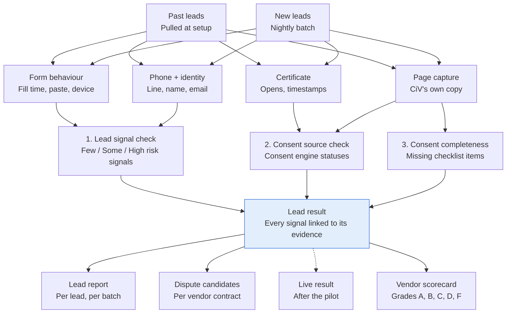

# Lead Inspector

**Version:** 3.0 · **Date:** 2026-10-07 · **Supersedes:** v1.1
**Changes from v1.0 are marked [v1.1]; changes from v1.1 are marked [v3]**
(see [CHANGELOG-v3.md](CHANGELOG-v3.md)). v3 leaves the three checks, the
scorecard and the test cases as they were, except where marked.

## Overview

The Lead Inspector reviews, in batch, every lead a client bought or
collected. For each lead it reports the risk signals the record shows,
whether the consent source checks out, and whether the consent is complete,
and it rolls these up into a scorecard per vendor. **v1 is batch only**; live
checking of each new lead comes after the pilot.

| Check | Question | Output | Build phase |
|---|---|---|---|
| 1. Lead signal check | Which signals suggest the form was not filled in by the owner of the number? | Few / Some / High risk signals, a score and the signals that fired | Phase 4, after counsel's credit-reporting review (C3) |
| 2. Consent source check | Does the consent proof agree with CiV's own page capture and the delivery time? | The consent engine's statuses, including `CF_PAGE_MISMATCH` and `CF_CERT_AFTER_DELIVERY` | Phase 2 |
| 3. Consent completeness | Which checklist items are missing from the consent page? | Missing items, each mapped to a consent code | Phase 2 |
| Vendor scorecard | How does each vendor's supply look over time? | Score 0–100 and grade A–F per vendor and sub-ID | Phase 4 |

## Guardrails

- **Not a consumer report.** Results describe signals in a lead record, for the client's review of its own vendors and consent. The client contract bars using them to decide anyone's eligibility for credit, insurance, employment, housing or any other benefit, or for marketing targeting. Carrier data is used only under the provider's written approval of this use case. Counsel reviews credit-reporting exposure before Check 1 is built (C3).
- **CiV does not block** leads or calls; the client decides what to do with a result.
- **Wording:** "Few risk signals", "Some risk signals", "High risk signals" — never a judgment about a person.
- **Test leads** CiV seeds for revocation tests are excluded from every result and score.
- **[v1.1] Never used as a signal:** anything that stands in for a protected characteristic.
- **[v3] Lead quality is not consent.** Fill time and paste (and every other Check 1 signal) are lead-quality signals. They feed the lead result and the vendor score, **never a consent status**. Consent check 5 reads `form_input_method` and `event_duration_ms` only to pass them here.
- **[v3] Certificates only through the client's key** (product rule 14). Every certificate lookup, claim and snapshot read uses the client's own TrustedForm / Jornaya account (access Level 2). CiV never claims or retains a certificate in its own account; billed operations need the client's written approval.
- **[v3] Fingerprints, not content.** Certificate contents, page snapshots and behavior data are read in memory; CiV keeps the derived results and a fingerprint of each record it read.

## Check 1: Lead signal check

Each signal that fires adds points from `li_signal_points`. Signals in
`li_hard_signals` set "High risk signals" on their own. **[v1.1]** Points,
hard signals and thresholds live only in the rulebook.

**[v3]** The source column now shows the **source grade** (v1.1 showed tier
2 for each): data CiV retrieves from an independent third party is grade B.

| Signal | Source (**[v3]** source grade) | Fires when | Points (`li_signal_points`) |
|---|---|---|---|
| Fast fill | Form behaviour data, via the client's certificate key (B) | Time on page under `li_min_form_seconds` | 25 |
| Instant fill | Form behaviour data, via the client's certificate key (B) | Time on page under `li_hard_signal_form_seconds` | hard |
| Pasted fields | Form behaviour data, via the client's certificate key (B) | Phone or name pasted | 10 |
| Device burst | Device / IP data (B) | Same device or IP sent ≥ `li_device_burst_count` of **this client's** forms within `li_device_burst_window_minutes` | 25 |
| Location mismatch | IP location vs form address (B) | Different states | 10 |
| Line out of service at lead date | Carrier lookup (B) | Number not in service, checked within `li_line_status_max_age_days` of the lead date only | hard |
| Line type | Carrier lookup (B) | Type in `li_suspect_line_types` | 10 |
| Name-match signal | Carrier caller name (B) | Similarity below `li_name_match_threshold`; no caller name = no points | 20 |
| Email signal | Commercial email-verification API (B) | Disposable domain or undeliverable address | 15 |
| New website | RDAP domain registration date (B) | Younger than `li_min_domain_age_days` | 15 |
| Certificate after delivery | Certificate time (B) vs `delivered_at` (C) | Later by more than `clock_skew_seconds` | hard |

**Result:** any hard signal, or score ≥ `li_high_risk_threshold` → **High
risk signals**; score ≥ `li_some_risk_threshold` → **Some risk signals**;
otherwise **Few risk signals**. Thresholds are inclusive. CiV stores the
**uncapped** score, the displayed score (capped at 100) and the list of hard
signals.

**Missing data:** signals whose source is missing show "not measured" and add
nothing; the result says which signals were not measured. **[v1.1]** Carrier
lookups run only when `li_carrier_lookup_enabled` for the client (pass-through
cost).

**Batch consistency:** device bursts are counted per client, and a nightly
batch pass recomputes burst signals across all of the day's leads.

## Check 2: Consent source check

The lead-level consent status is the consent engine run on a hypothetical
contact at the lead's delivery time — **[v1.1]** defined by
`li_hypothetical_contact` (default `strictest`: an autodialed marketing
contact on every channel the lead covers). Two checks here feed the engine's
step 4:

| Code | Fires when |
|---|---|
| `CF_PAGE_MISMATCH` | CiV's capture of the certificate's page URL has similarity **below** `ca_page_match_threshold` to the certificate's snapshot, measured by `page_similarity_method`. Only captures within `page_snapshot_max_gap_days` of consent are compared; others are "not comparable". **[v1.1]** Backfilled leads are always "not comparable — no contemporaneous capture". |
| `CF_CERT_AFTER_DELIVERY` | Certificate created after `delivered_at` by more than `clock_skew_seconds`. Within the tolerance → `WK_TIMING_UNCERTAIN`. |

Before building `CF_PAGE_MISMATCH`, confirm with ActiveProspect that
certificate page snapshots are available through the API (**D13**).

**[v3] Certificate custody check** (runs before the engine's step 2). For
each certificate, record `consent_proof.custody`:

| Custody | Meaning | Effect here |
|---|---|---|
| `client_account` | Claimed in the client's own account | Evaluated normally |
| `vendor_only` | Claimed by the vendor only | Evaluable only while the vendor shares it. A finding names the vendor and the share of its leads affected |
| `unclaimed` | Never claimed | Reported; unclaimed certificates go dark after about 72 hours (`cert_unretained_expiry_hours`) |

Custody is shown per vendor beside the scorecard; v3 adds no custody rate to
the vendor score.

**[v3] When a certificate no longer opens** (engine step 2):

| Code | Fires when | Status |
|---|---|---|
| `WK_FINGERPRINT_ONLY` | The certificate no longer opens at the provider, but CiV fetched it earlier and holds its fingerprint and trusted timestamp. Proves it existed on that date; cannot show its content | WEAK |
| `CF_NOT_FOUND` | Not at the provider **and** no CiV fingerprint (the lead record names a certificate the provider does not have) | CONFLICTING |

There is no "CiV stored copy" any more. For a `WK_FINGERPRINT_ONLY` lead,
`CF_PAGE_MISMATCH` cannot be measured and the page comparison shows "not
comparable — certificate no longer opens".

**[v3] Phone match.** Step 4 submits the phone to the provider's
`fingerprints.matching`; CiV never needs the certificate's stored phone.

## Check 3: Consent completeness

Uses the one counsel-owned `consent_checklist` shared with the consent
engine. Measurable items are rule-based browser measurements on each viewport
in `cc_viewports`; only meaning uses AI (behind its accuracy gate).
**[v1.1]** Seller identity gets a rule-based first pass so it is measured from
Phase 2.

| Item | How measured | Effect when a required item fails |
|---|---|---|
| `CC_CONSENT_TEXT` | Rule (consent-block present) + AI (meaning) | `NP_NO_CONSENT_TEXT` |
| `CC_UNTICKED` | Rule | `NP_PRETICKED` |
| `CC_SELLER_NAMED` | **[v1.1]** Rule first: brand / DBA token match ≥ `seller_match_threshold` in the consent block or partner-list capture as of the consent date → `matched`; a different known seller → `other_seller` → engine's `CF_SELLER_MISMATCH`; nothing found → `not_found` → per `seller_absent_effect` (B7). AI only refines meaning after its gate | as stated. **[v3]** Only when counsel sets `seller_named_required` = true (default false); otherwise the match result is reported as information with no status change |
| `CC_SELLER_COUNT` (CiV policy since the one-to-one rule was vacated) | Rule | Policy warning, or `WK_WORDING` if counsel marks it required |
| `CC_OPT_OUT` | AI | `WK_WORDING` |
| `CC_NOT_CONDITION` ("consent is not a condition of purchase") | AI | `WK_WORDING` |
| `CC_NUMBER_SHOWN` | Rule | `WK_WORDING` |
| `CC_AUTODIAL_DISCLOSED` | AI | `WK_WORDING` |
| `CC_BUTTON_MATCH` | Rule | `WK_WORDING` |
| `CC_FONT_SIZE` (`cc_min_font_px`) | Rule | `WK_WORDING` |
| `CC_CONTRAST` (`cc_min_contrast_ratio`) | Rule | `WK_WORDING` |
| `CC_ABOVE_BUTTON` | Rule | Warning |
| `CC_NO_SCROLL` | Rule | Warning |

A failed **optional** item is always a warning with no status change.
**[v1.1]** Every item's effect is `affects_status` and therefore
counsel-approved before an approved rulebook ships.

## Vendor scorecard

Per client, per vendor and sub-ID, over `vs_window_days`, computed monthly.

$$\text{Vendor score} = \operatorname{clamp}_{0}^{100}\Big(100 \times \big(1 - \textstyle\sum_i w_i \cdot r_i\big)\Big)$$

| Rate r | How it is counted | Weight w (`vs_rate_weights`) |
|---|---|---|
| High-signal lead rate | (High + `vs_some_weight` × Some) ÷ leads | 0.35 |
| Consent problem rate | Leads NO_PROOF or CONFLICTING ÷ leads | 0.30 |
| Consent gap rate | Leads with a required checklist item failed ÷ leads | 0.15 |
| Name-match signal rate | Leads with the name-match signal ÷ leads | 0.10 |
| Late delivery rate | Delivered more than `vs_max_delivery_hours` after consent ÷ leads | 0.05 |
| Stop and complaint rate | Stops or complaints within `vs_stop_window_days` of first contact ÷ contacted leads whose window has **finished** | 0.05 |

Weights must sum to 1: the rulebook refuses to load otherwise. A rate with a
zero denominator is left out and the other weights are re-normalised. Grades:
A ≥ 90, B ≥ 80, C ≥ 70, D ≥ 60, F below 60 (`vs_grade_bands`). Vendors under
`vs_min_leads_for_score` leads show "not enough data". An alert fires when a
score drops by `vs_alert_drop_points` or more month on month.

**Example:** 1,000 leads; 50 High and 100 Some (rate 0.10), 80 consent
problems (0.08), 300 with gaps (0.30), 40 name-match (0.04), 100 late (0.10),
20 stops of 1,000 finished windows (0.02). Penalty 0.35·0.10 + 0.30·0.08 +
0.15·0.30 + 0.10·0.04 + 0.05·0.10 + 0.05·0.02 = 0.114 → **88.6, grade B**.

## Dispute candidates

A per-vendor list the client may raise under its vendor contract. Included:
leads with High risk signals, or consent NO_PROOF or CONFLICTING, still inside
the vendor's dispute window (the last day included; **[v1.1]** window from
the contract, else `default_dispute_window_days` = 0 → "no contract on
file"). Each row: lead ID, vendor, sub-ID, date, price, result, reasons,
evidence link. Leads with no price are counted, flagged and left out of the
total. CiV never contacts vendors.

## Leads, contacts and the provenance ladder **[v3]**

The Lead Inspector and M06 work on **lead records** (one row per lead a
vendor or form delivered). The provenance ladder (main spec §5a) works on
**contacts**: for each contacted number it takes the latest lead with
`received_at` ≤ first contact and assigns a basis (`feed` → `crm_field` →
`invoice` → `cert_domain` → `manual_import` → `untraced`), stored on
`lead.basis`. The two answer different questions and use different
denominators:

| Figure | Counts | Where |
|---|---|---|
| Lead results, vendor scorecard, M26–M30, M06 | Leads | This document; M06 in Permission |
| Provenance ladder, M32 | Contacts | Lead Provenance chart; main spec §5a |
| M33, M34 | Numbers | Import batches; main spec §5a |

**Never mix the two in one figure.** A vendor's share of contacts (ladder) and
its share of leads (scorecard) may both appear on a page, each labelled with
its own unit. Numbers that arrived by manual import have no vendor lead to
inspect; they are covered by the evidence search and proof requests, not by
the Lead Inspector.

## Live mode (after the pilot)

Not in v1. Before it ships: contract terms making clear the result is
informational and the client decides; an uptime service level; an always-on
API with `lg_response_timeout_ms`; a PENDING result for slow sources; a
dead-letter alert when all `lg_webhook_retry_count` retries fail; and the
nightly burst recompute, which may raise a live result.

## Settings and data dependencies

All settings are in [02-rulebook-parameters.md](02-rulebook-parameters.md).
Data dependencies (all in the main spec's source table, **[v1.1]** including
email verification and RDAP):

- **Form behaviour, device and IP data:** bought by the client from its certificate vendor (TrustedForm Insights, about $0.05 per data point). **[v3]** Read through the client's own key only (rule 14); the client approves billed operations in writing.
- **[v3] Vendor concentration:** TrustedForm and Jornaya are both ActiveProspect since January 2026. A terms or API change there affects both certificate sources at once; the certificate adapter sits behind one interface.
- **Carrier line type, line status and caller name:** official lookup provider under written use-case approval (Twilio Lookup about $0.008 line type, $0.01 caller name). Its terms bar consumer reports and eligibility uses. **[v1.1]** Runs on CiV's account; billed to the client as a pass-through when `li_carrier_lookup_enabled`.
- **Email:** commercial verification API, never direct mail-server probing.
- **Domain age:** public registration lookup (RDAP).

Metrics M26–M30 are defined in [03-metric-specs.md](03-metric-specs.md).

## Test cases

Default settings; thresholds 40 (Some) and 70 (High).

| ID | Setup | Expected |
|---|---|---|
| L01 | Filled in 5 s; nothing else | 25 → Few |
| L02 | 5 s; phone pasted; disposable email | 50 → Some |
| L03 | Filled in 1.5 s | Stored score 25 (fast fill) + hard signal "instant fill" → High |
| L04 | 7 of this client's forms from one device in 40 min; name mismatch; site 30 days old | 60 → Some |
| L05 | L04 plus location mismatch and non-fixed VoIP | 80 → High |
| L06 | Number out of service, checked 5 days after the lead | Hard signal → High |
| L07 | No caller name on record; nothing else | 0 → Few |
| L08a | Certificate 10 min after delivery; contact after the certificate | High; consent CONFLICTING `CF_CERT_AFTER_DELIVERY` |
| L08b | Same, with a contact between delivery and certificate | That contact NO_PROOF `NP_BEFORE_CONSENT` |
| L09 | Capture similarity 0.72, captured the same day | CONFLICTING `CF_PAGE_MISMATCH` |
| L10 | Box pre-ticked | NO_PROOF `NP_PRETICKED` |
| L11 | Otherwise VERIFIED; normal-size text at contrast 3.1 : 1 | WEAK `WK_WORDING` (rule-based, counts before any AI gate) |
| L12 | Vendor with 80 leads | "Not enough data" |
| L13 | Scores exactly 40 and exactly 70 | Some; High |
| L14 | Scorecard example above | 88.6, B |
| L15 | High-signal lead delivered 20 days ago; window 14 days | Not a dispute candidate; still in the score |
| L16 | Signals total 130 | Stored 130, displayed 100 |
| L17 | Behaviour data not bought | Form signals "not measured"; result says so |
| L18 | No carrier provider configured or `li_carrier_lookup_enabled` false | Line and name signals "not measured" |
| L19 | Backfill: lead from 2023, number now disconnected | Line-status signal not used (outside `li_line_status_max_age_days`) |
| L20 | 7 forms from one device across the day | Nightly pass scores all 7 with the burst signal |
| L21 | Certificate 60 s after delivery | `WK_TIMING_UNCERTAIN`, no hard signal |
| L22 | Page captured 5 days after consent | Not compared; listed as not comparable in M27 |
| L23 | Lead delivered exactly 14 days ago; window 14 days | Still a dispute candidate |
| L24 | Dispute candidate with no price | Counted, flagged, left out of the total |
| L25 | Weights sum to 1.1 | Rulebook load refused |
| L26 | CiV-seeded test lead | Excluded from all results and scores |
| L27 | Large text at 3.2 : 1 | Passes contrast |
| L28 | Vendor score drops exactly 10 points | Alert fires |
| L29 | Vendor with no contacted leads | Stop rate left out; weights re-normalised |
| **[v1.1]** L30 | Consent block names "Acme Solar LLC"; client brand "Acme Solar" | `seller_match = matched`; no seller code |
| **[v1.1]** L31 | Consent block names only "Best Leads Network" (a known other seller) | `other_seller` → CONFLICTING `CF_SELLER_MISMATCH` |
| **[v1.1]** L32 | Consent block names no seller at all; strict variant | `not_found` → NO_PROOF `NP_SELLER_ABSENT` (lenient: WEAK `WK_SELLER_NOT_FOUND`) |
| **[v1.1]** L33 | Backfilled lead from 2024, certificate snapshot present, no CiV capture | Check 2 page comparison "not comparable — no contemporaneous capture"; no `CF_PAGE_MISMATCH` |
| **[v1.1]** L34 | Vendor with no contract on file; High-signal lead delivered yesterday | Not a dispute candidate; "no contract on file" |
| **[v3]** L35 | Certificate no longer opens; CiV fingerprint and trusted timestamp on record | WEAK `WK_FINGERPRINT_ONLY`; page comparison "not comparable — certificate no longer opens" |
| **[v3]** L36 | Certificate not at the provider; no CiV fingerprint | CONFLICTING `CF_NOT_FOUND` |
| **[v3]** L37 | Certificate claimed by the vendor only | `custody = vendor_only`; finding names the vendor and its share of leads affected |
| **[v3]** L38 | Otherwise VERIFIED; filled in 1.5 s | Lead result High (instant fill); consent status stays VERIFIED |
| **[v3]** L39 | L32 setup with `seller_named_required` = false (default) | `not_found` reported as information; no seller code, no status change |
| **[v3]** L40 | Certificate lookup attempted without a client key | Not run; no lookup on any CiV account (rule 14); Check 2 "not measured — certificate key not connected" |

## Limits

- **Signals are probabilities, not proof.** "Some risk signals" means look closer. Reports say what fired, not what anyone intended.
- **Carrier caller names are often missing for mobile numbers,** so the name-match signal is silent more often than it fires.
- **IP location is rough** and VPNs defeat it, which is why it carries only 10 points.
- **Vendors may learn the signals.** Review points and thresholds each quarter against confirmed outcomes.
- **AI items count only after their accuracy gate;** rule-based items count from Phase 2.
- **[v1.1] Historical leads cannot be page-matched;** buyers are told this at onboarding.
- **[v3] A deleted certificate cannot be shown.** If a vendor deletes a certificate, CiV can prove it existed on a date (`WK_FINGERPRINT_ONLY`) but cannot show its content.
